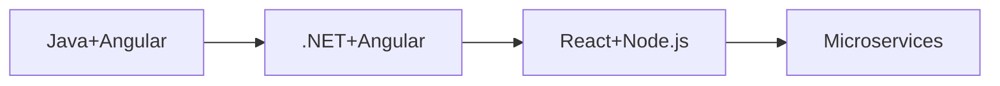

<div align="center">

# 🌟 Welcome to Bhupesh Kumar's Digital Universe 🌟


[](https://github.com/bhupeshkumar)
[](https://www.linkedin.com/in/bhupesh-kumar-809b05241/)
[](mailto:bhupeshkumar052000@gmail.com)
[](https://github.com/bhupeshkumar)


</div>


##  About Me


🚀 **Passionate Full-Stack Developer** with expertise in modern web technologies and a revolutionary focus on **GenAI-powered development**. I specialize in building scalable applications across multiple technology stacks with hands-on experience in cloud platforms, microservices architecture, and AI-driven development workflows.

 Currently working on **GenAI Agent Mode projects** and **cross-technology migrations**

 Exploring **AI-powered development**, **microservices architecture**, and **cloud-native solutions**

 Passionate about **clean code**, **system design**, and **emerging technologies**

 Average in **Data Structures & Algorithms** but strong in **practical implementation**

 Open to **collaboration** and **innovative projects**


##  Tech Arsenal

<div align="center">


</div>

<table align="center">
<tr>
<td align="center" width="200">

<br><strong>Languages</strong>
</td>
<td align="center" width="200">

<br><strong>Frontend</strong>
</td>
<td align="center" width="200">

<br><strong>Backend</strong>
</td>
<td align="center" width="200">

<br><strong>Database</strong>
</td>
</tr>
<tr>
<td align="center">


</td>
<td align="center">


</td>
<td align="center">


</td>
<td align="center">


</td>
</tr>
</table>

<div align="center">

### 🛠️ **DevOps & Tools**


</div>


##  Featured Projects

<div align="center">

</div>

<div align="center">

### 🤖 **GenAI Agent Mode: Complete Technology Migration Journey**


> *🚀 Revolutionary AI-powered development showcasing cross-technology migrations*

</div>

<table>
<tr>
<td width="50%">

**🌟 Highlights:**
- 🎯 **100% GenAI Development** - Zero manual coding
- 🔄 **Multi-Stack Migration** - Java → .NET → React/Node.js
- 🏭 **Production-Ready** - Enterprise applications from AI
- 📚 **Documented Journey** - Complete prompt engineering

</td>
<td width="50%">

**🛠️ Tech Stack:**
```yaml
Languages: Java, C#, JavaScript, TypeScript
Frameworks: Spring Boot, .NET, React, Angular
Databases: MySQL, MongoDB
Tools: Docker, AWS, Git
```

</td>
</tr>
</table>

**📊 Architecture Evolution:**


---

### 🏍️ **Premium Motorcycle Showroom Management System**
> *Full-stack e-commerce platform with advanced inventory management*

**✨ Features:**
- **Variant-Based Inventory** - Color variants, stock management
- **Premium UI/UX** - Royal Enfield-themed professional interface
- **Secure Authentication** - JWT-based role management
- **Real-time Cart** - Dynamic pricing and stock validation
- **Admin Dashboard** - Comprehensive product management

**🛠️ Tech Stack:** Spring Boot, Angular, MySQL, JWT, Redis, RabbitMQ

---

### 🔐 **Advanced Authentication System**
> *Comprehensive user management with modern security features*

**🔒 Security Features:**
- **Multi-factor Authentication** - Email verification, OTP validation
- **Password Management** - Secure reset, encryption with BCrypt
- **Session Management** - JWT tokens, role-based access
- **File Upload** - Profile image management
- **Responsive Design** - Mobile-first approach

**🛠️ Tech Stack:** Node.js, Express, MongoDB, JWT, Handlebars, Multer

---

### 🛒 **E-commerce Platform**
> *Complete online shopping solution with admin panel*

**🛍️ Features:**
- **Multi-category Products** - Men, Women, Kids collections
- **Shopping Cart** - Real-time cart management
- **Order Processing** - Complete order lifecycle
- **Admin Panel** - Product management, order tracking
- **Payment Integration** - Secure payment processing

**🛠️ Tech Stack:** Node.js, Express, MongoDB, Handlebars, CSS3

---

### 🌤️ **Weather Application**
> *Real-time weather information with beautiful UI*

**☀️ Features:**
- **Real-time Data** - Current weather conditions
- **Visual Indicators** - Weather-based icons and themes
- **Responsive Design** - Works across all devices
- **Clean Interface** - Intuitive user experience

**🛠️ Tech Stack:** React, Vite, CSS3, Weather API

---

### 📱 **Social Media Platform**
> *Modern social networking application*

**🌐 Features:**
- **User Profiles** - Customizable user profiles
- **Post Management** - Create, edit, delete posts
- **Social Interactions** - Like, comment, share functionality
- **Real-time Updates** - Live feed updates
- **Responsive Design** - Mobile-optimized interface

**🛠️ Tech Stack:** React, Redux, Tailwind CSS, Node.js

---

## 🏆 Key Achievements

### 🤖 **GenAI Development Excellence**
- ✅ **Zero Manual Coding** - 100% AI-generated enterprise applications
- ✅ **Cross-Technology Mastery** - Seamless migrations between Java, .NET, React, Node.js
- ✅ **Architectural Intelligence** - AI-driven monolith to microservices transformation
- ✅ **Production Quality** - Enterprise-ready applications from prompts alone
- ✅ **Innovation Leadership** - Pioneering AI-powered development workflows

### 📈 **Development Impact**
- 🚀 **10x Faster Development** - Complete applications in hours, not weeks
- ⚡ **Instant Technology Migration** - Cross-platform transitions in minutes
- 🎯 **Consistent Quality** - AI maintains coding standards across all technologies
- 📚 **Knowledge Acceleration** - Multiple tech stacks mastered simultaneously

---


##  GitHub Analytics

<div align="center">


<table>
<tr>
<td width="50%">


</td>
<td width="50%">


</td>
</tr>
</table>


</div>

---

## 🎯 Current Focus

```javascript
const bhupeshKumar = {
    currentFocus: [
        "GenAI Agent Mode Development",
        "Microservices Architecture",
        "Cloud-Native Solutions",
        "AI-Powered Development Workflows"
    ],
    learning: [
        "Advanced System Design",
        "Kubernetes & Container Orchestration",
        "AI/ML Integration in Web Development",
        "Serverless Architecture"
    ],
    collaboration: [
        "Open Source Projects",
        "GenAI Development Tools",
        "Cross-Technology Migrations",
        "Innovative Web Solutions"
    ]
};
```

---

## 🌟 What Makes Me Different

- 🤖 **GenAI Pioneer** - Leading the revolution in AI-powered development
- 🔄 **Technology Agnostic** - Seamlessly work across multiple tech stacks
- 🏗️ **Architecture Focused** - Strong understanding of scalable system design
- 📚 **Continuous Learner** - Always exploring cutting-edge technologies
- 🤝 **Collaborative Spirit** - Open to innovative projects and partnerships

---


##  Let's Connect & Collaborate!

<div align="center">


<table>
<tr>
<td align="center">
<a href="https://www.linkedin.com/in/bhupesh-kumar-809b05241/">

<br><strong>LinkedIn</strong>
</a>
</td>
<td align="center">
<a href="mailto:bhupeshkumar052000@gmail.com">

<br><strong>Email</strong>
</a>
</td>
<td align="center">
<a href="https://github.com/bhupeshkumar">

<br><strong>GitHub</strong>
</a>
</td>
<td align="center">
<a href="#">

<br><strong>Portfolio</strong>
</a>
</td>
</tr>
</table>

### 💬 **Open to discussing:**
🤖 GenAI Development Opportunities | 🚀 Full-Stack Projects | 🏗️ Architecture Consulting | 🌟 Open Source Collaborations

</div>

---


<div align="center">


###  "Building the future, one line of code at a time" 


**⭐ If you find my work interesting, please consider giving my repositories a star! ⭐**

 *Built with 🤖 GenAI Agent Mode and ❤️ for clean code* 


**© 2024 Bhupesh Kumar - Crafting Digital Excellence**

</div>